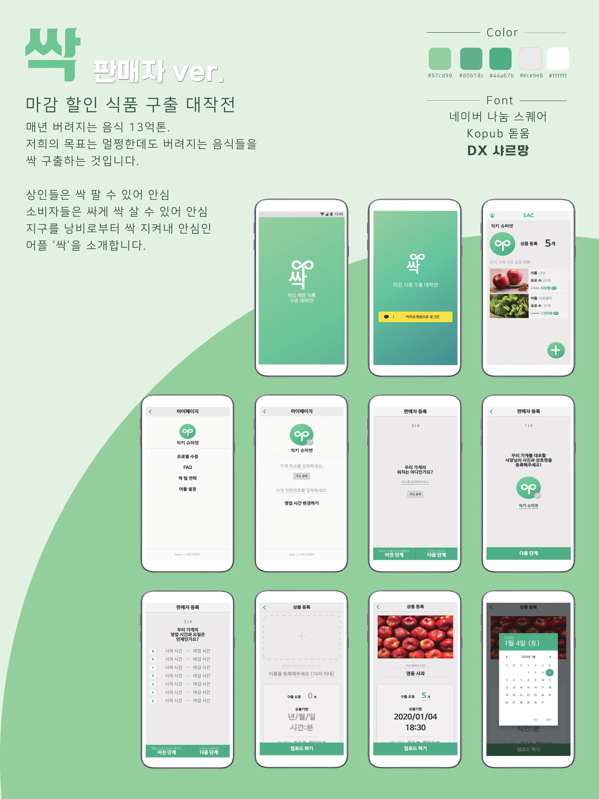

마감 할인 식품 구출 플랫폼, 싹
================
판매자용 안드로이드 어플리케이션
  
  

 
 
**2020 KOREA HACKS**
  * 2020.01.04 ~ 2020.01.05

 

## Development Environment
 

* Development Language : Java
* Complie SDK Version : 28
* Minimum SDK Version : 23
* Target SDK Version : 28

 

## Dependencies
* Circle ImageView : de.hdodenhof:circleimageview
* Image Upload : com.github.bumptech.glide:glide
* Render After Effects animations natively : com.airbnb.android:lottie
* HTTP RESTAPI Connected with Web Server : com.squareup.retrofit2:retrofit
* Convert JSON into Object : com.squareup.retrofit2:converter-gson
* Kakao Auth : com.kakao.sdk , name : 'usermgmt'
* Kakao Link : com.kakao.sdk , name : 'kakaolink'
* Daum Address Searching Service based on Postal Code
* Extract Latitude, Longitude from "https://dapi.kakao.com/v2/local/search/address.json"
 

## App View

